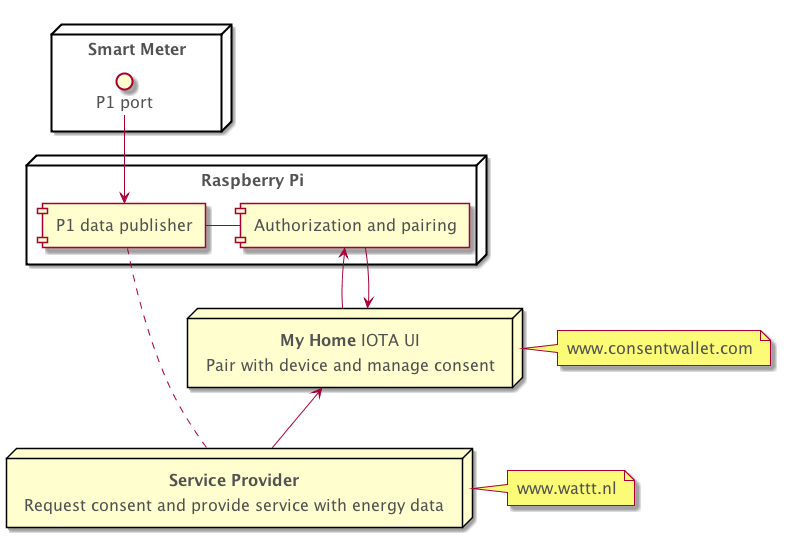

# Energy usage data streams with consent of device owner Proof of Concept

---


---

Sharing high frequency smart meter data with explicit consent of the consumer can help the energy transition in the Netherlands. This Alliander R&D project investigates the use of the distributed ledger IOTA and Masked Authenticated Messaging (MAM) for decentralized energy data streams adhering to the GDPR privacy regulation.


<sub>*A Raspberry Pi running IOTA interfacing software connected via a P1 cable (USB to RJ11) to a Dutch smart meter.*</sub>

Also see the blog post [GDPR-compliant smart meter data on the IOTA Tangle — four lessons learned while putting the consumer in control](https://medium.com/@erwinrooijakkers/gdpr-compliant-smart-meter-data-on-the-iota-tangle-four-lessons-learned-while-putting-the-dea852a5b2aa).

## Goals

- User is in control of his data
- A level playing field is created where service providers (e.g., app developers) can use the data
- Data goes from smart meter to service provider directly (directly via a restricted MAM channel)
- Adheres to GDPR by asking for goal and consent
- Decentralized consent management via [IOTA MAM](docs/technologies.md#iota-mam)
- Post-quantum cryptography (signing via [IOTA Kerl](docs/techologies.md#iota) and asymmetric encryption via [NTRU](docs/techologies.md#ntru))

## Components



* Smart Meter: Dutch Smart Meter with a high frequency energy data port (P1 port).
* [Service Provider Wattt Insights](service-provider): An example of a service provider that graphs energy usage data and interfaces with My Home.
* [Raspberry Pi energy data reader](raspberry-pi-client): A Raspberry Pi that is connected to a Dutch smart meter's P1 port (with high frequence energy data) via a USB to RJ11 cable.
* [My Home](my-home): An IOTA wallet that contains your devices and consent frontend that interfaces with IOTA where users can:
  1. Pair with one Raspberry Pi (so that My Home can send the Pi instructions via a restricted MAM channel)
  1. Give consent for service provider to access data
  1. Revoke consent of service provider to access data

## Cloning

```
git clone git@github.com:Alliander/decentralized-auth.git
cd decentralized-auth
```

## Running locally

Install [Docker](https://www.docker.com/community-edition) and [Docker Compose](https://docs.docker.com/compose/install). Use node version 8.6. Then run:

```
docker-compose up
```

Navigate to localhost:4000 for My Home consent management wallet and to localhost:5000 for the Wattt Insights service provider example.

To start components separately:

Set environment variables:

```
export IOTA_PROVIDER=xxxxxx # when not running local-testnet
export IOTA_MIN_WEIGHT_MAGNITUDE=14
```

Start My Home consent management backend (which serves the frontend as well):

```
cd my-home/backend && npm start
```

Start Service Provider wattt.nl backend (which serves the frontend as well):
```
cd service-provider/backend && npm start 
```

Start the Raspberry Pi client locally with a fresh seed.

```
cd raspberry-pi-client 
SEED=$(cat /dev/urandom | LC_ALL=C tr -dc 'A-Z9' | fold -w 81 | head -n 1) npm start
```
When connecting a RJ11 cable to USB ensure the `P1_SERIAL_PORT` environment variable is set to its USB serial port.

See the separate projects's READMEs for more information.

## Production

Run the [raspberry-pi-client](raspberry-pi-client) on a Raspberry Pi connected with a smart meter using a RJ11 cable.  
Deploy [my-home](my-home/backend). An example runs at [www.iotahome.nl](https://www.iotahome.nl).  
Deploy [service-provider](service-provider/backend). An example runs at [www.wattt.nl](https://www.wattt.nl).  

## Further information

- [A description of the architecture](docs/architecture.md)
- [The scenarios (pairing with a device, giving consent, revoking consent)](docs/scenarios.md)
- [The technologies used](docs/technologies.md)
- [The advantages and disadvantages of using IOTA for GDPR proof energy data streams](docs/advantages-and-disadvantages.md)
- [And issues we are aware of](docs/known-issues.md)

## Contributing

We would be happy if you can create issues (also for suggestions) or pull requests.

## License

© 2018 [Alliander](https://www.alliander.com)  
This project is licenced under [Apache 2.0](LICENCE).
