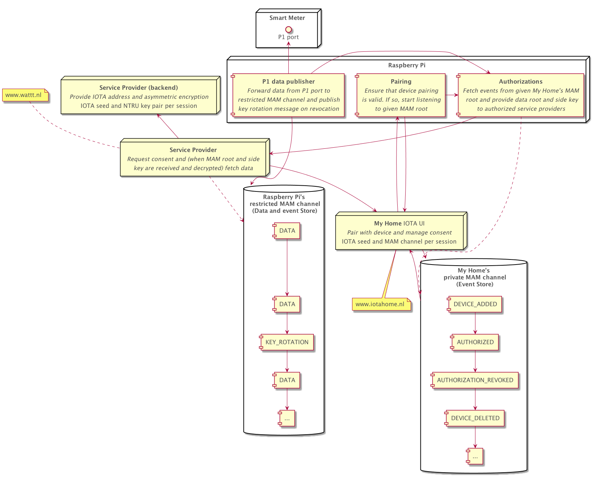

# Architecture

Dutch Smart meters have a P1 port which gives consumers access to real time measurements with a high resolution. These measurements can be used for consumption analysis and other value added services. This project consists of a Raspberry Pi connected to the P1 port of a smart meter. There is also a frontend called My Home that interfaces with IOTA where users can:

- Pair and unpair with Raspberry Pi
- Give consent for service provider to access data
- Revoke consent of service provider to access data

Note: the My Home application now makes use of a backend, but there is no need for that. A backend makes it in fact a bit more difficult then running on a frontend only, because with a backend a session id needs to be correlated with the seed.

And finally an example Service Provider Wattt Insights. It graphs energy usage data and can request consent at My Home.

The proof of concept example of My Home can be visited at [www.iotahome.nl](https://www.iotahome.nl).  
The proof of concept example of Wattt Insights can be visited at [www.wattt.nl](https://www.wattt.nl).  

## Component diagram

So the Raspberry Pi publishes P1 data to a restricted MAM channel. My Home can pair with a Raspberry Pi P1 reader using a shared secret.

Once the Pi is paired it starts listening to My Home's private MAM channel. When a user want to authorize a service provider (e.g., an app) to access data, the service provider redirects to My Home to request consent. When consent is given an `AUTHORIZED` message is published on My Home's private MAM channel (containing the public key and IOTA address of the service provider). This is a trigger for the Raspberry Pi to send an IOTA transaction containing the root and side key to this service provider, encrypted with the service provider's public key so it cannot be read by others. The service provider can then decrypt the root and side key and fetch the messages from the Raspberry Pi's restricted MAM channel. 

If the user decides on My Home to revoke the consent policy an `AUTHORIZATION_REVOKED` message is published. This is the trigger for the Raspberry Pi to attach a `KEY_ROTATION` message on its restricted MAM channel. This contains the new key, encrypted with the public key of all service providers who are still authorized. So that those who are still authorized can switch the side key and keep on listening, and others have their consent revoked.

For more information on NTRU key pairs, MAM channels, and Event Stores see [technologies used](technologies.md).

## Sequence Diagram

The full sequence diagram.

For descriptions of every subheader see [scenarios](scenarios.md).
