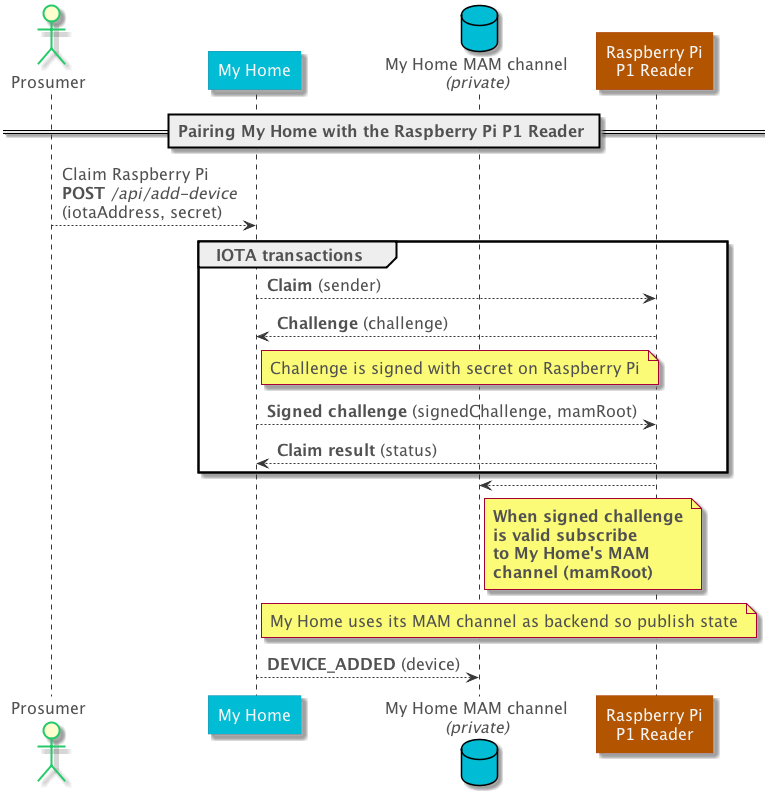

# Scenarios

This document describes the various scenarios.

## Adding a device

To proof a raspberry-pi-client is yours, in this solution, you need to proof that you have seen the secret that is on the device. 

All communication takes place via IOTA transactions. Because this is public communication, showing that you know the secret takes a few steps. Steps so that an attacker is prevented from also knowing the secret and being able to claim the device.

First a user clicks the 'Add Raspberry Pi' button.

When the device is paired it will start listening to My Home's MAM channel, where the events `AUTHORIZED` and `AUTHORIZATION_REVOKED` will be published when a user gives or revokes consent to a service providerto access the energy usage data.

### Sequence diagram

## Publishing data

A device publishes data when a P1-telegram is received on the `P1_SERIAL_PORT` environment variable.

### Sequence diagram

## Authorizing a Service Provider

The goals of authorizing a service provider are:
1. Communicating the MAM root and side key of the Raspberry Pi's MAM channel to the service provider
1. Storing the authorization somewhere so that the service provider and device owner can point to it

When the button is pressed the device receives a `CLAIM_DEVICE` message on its IOTA address. The device will respond with a `CHALLENGE` that needs to be signed with the secret on the device. My Home signs the challenge with the provided secret using Kerl hashing and returns this along side its root of its private MAM channel in a `SIGNED_CHALLENGE` message. If the signed challenge is valid the device starts listening to the MAM root and returns with a `CLAIM_RESULT` of "OK". My Home then publishes a `DEVICE_ADDED` event on its private MAM channel so it can always retrieve this.

When the device is paired it will start listening to My Home's MAM channel, where the events `AUTHORIZED` and `AUTHORIZATION_REVOKED` will be published when a user gives or revokes consent to a service provider to access the energy usage data.

### Sequence diagram

## Revoking access for a Service Provider

A user can revoke consent under Policies in My Home. This starts the following sequence:

An `AUTHORIZATION_REVOKED` message is added to My Home's event stream. The Raspberry Pi fetches this message, creates a new side key, removes the service provider from the set of authorized service providers, and informs the still authorized service provider of the new side key.

The latter is done by encrypting the side key with the public keys of the service providers, and adding it to a `KEY_ROTATION` message. This message is then added to the MAM stream. 

Still authorized service providers fetch this from the MAM stream and can decrypt the new side key. Those who are no longer authorized do see the message, but cannot decrypt it. For them no new energy data can be fetched.

### Sequence diagram

## Deleting a device

When a device (raspberry-pi-client) is deleted a message with type `DEVICE_DELETED` is published on the MAM channel of My Home. This way My Home knows to no longer display the device, and the raspberry-pi-client knows that it should revoke all current authorizations.

