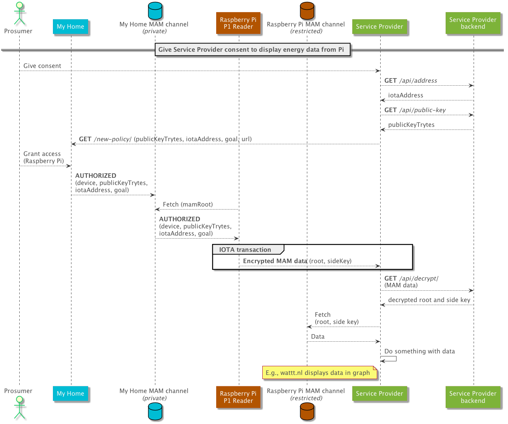

# Scenarios

This document describes the various scenarios.

## Adding a device

To proof a raspberry-pi-client is yours, in this solution, you need to proof that you have seen the secret that is on the device. 

All communication takes place via IOTA transactions. Because this is public communication, showing that you know the secret takes a few steps. Steps so that an attacker is prevented from also knowing the secret and being able to claim the device.

First a user clicks the 'Add Raspberry Pi' button.

When the device is paired it will start listening to My Home's MAM channel, where the events `AUTHORIZED` and `AUTHORIZATION_REVOKED` will be published when a user gives or revokes consent to a service providerto access the energy usage data.

### Sequence diagram

## Authorizing a Service Provider

The goals of authorizing a service provider are:
1. Communicating the MAM root and side key of the Raspberry Pi's MAM channel to the service provider
1. Storing the authorization somewhere so that the service provider and device owner can point to it

### Sequence diagram

## Revoking access for a Service Provider

### Sequence diagram

## Deleting a device

When a device (raspberry-pi-client) is deleted a message with type `DEVICE_DELETED` is published on the MAM channel of My Home. This way My Home knows to no longer display the device, and the raspberry-pi-client knows that it should revoke all current authorizations.

